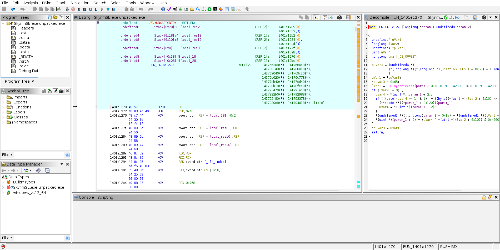
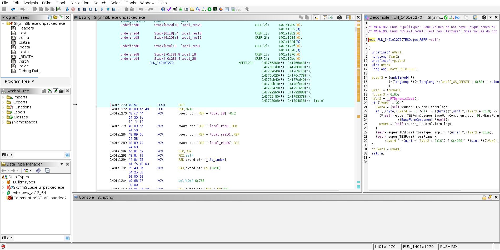

# Demo: a fully-typed SkyrimSE.exe in Ghidra, one command

**The problem, in the community's own words.** The Skyrim RE onboarding
tutorial tells new reversers to find *"a types.h floating on the RE server
with 1.5.97 data structures from like 3 years ago"* — a stale,
hand-maintained file on a private Discord. Without types, Ghidra shows you
`FUN_1412345678(undefined8 param_1)` and raw offsets.

**What this demo shows.** One command takes your own `SkyrimSE.exe`
(AE 1.6.1170) plus this repo's generated type archive and produces a Ghidra
project where the same functions decompile with real CommonLibSSE-NG types:
named structs, correct field offsets (validated against the headers' own
`static_assert`s by CI on every change), vtable layouts.

**The crash-triage angle.** Crash logs and disassembly hand every modder a
raw address and an offset — `[rcx+0x10]`, `[rcx+0x1a]` — of *some* struct.
The type archive tells you what those offsets *mean*: see
[`examples/`](examples/README.md) for a real `TESObjectREFR` virtual where
`[+0x10]` becomes `formFlags` and `[+0x1a]` becomes `formType`, turning
opaque bit-twiddling into legible form logic. (To be clear: this makes the
binary *readable*, it does not prevent crashes.)

**In Ghidra itself, not just as a text diff — before and after:**

**Before** — fresh import, auto-analyzed, no type archive applied:



**After** — same binary, same function, this repo's `.gdt` applied:



*Note the one visible artifact in this shot: `__RTDynamicCast()` on line 16
lost its call arguments — a side effect of retyping this call in isolation
rather than a full RTTI-analysis pass, not a sign the applied types are
wrong. Explained further below.*

Both are real screenshots of a real `SkyrimSE.exe` (Steamless-unpacked, AE
build 24604991) opened in Ghidra 12.1.3, same function
(`FUN_1401e1270`), same address — not mockups, not the same image edited
twice. The "before" shot is a completely separate, freshly-imported
Ghidra project with no archive ever applied, not an undo of the "after"
one. The Decompile panel goes from `FUN_1401e1270(longlong *param_1,
undefined8 param_2)` with `*(uint *)(param_1 + 2)`-style raw offset
arithmetic to `FUN_1401e1270(TESObjectREFR *self)` with
`self->super_TESForm.formFlags` and `.formType._impl`. (`super_TESForm` is
Ghidra's own naming convention for a flattened base-class member, not
something this project invents — it's how Ghidra always names an embedded
base subobject.) One honest artifact visible in the "after" shot: line 16's
`lVar2 = __RTDynamicCast();` lost its call arguments compared to what a
fully-typed build would show — a side effect of retyping this particular
call in isolation rather than a full RTTI-analysis pass, not a sign the
applied types are wrong. The
[`examples/`](examples/README.md) directory has the same before/after as
plain text if you want to diff it directly.

## First: unpack the SteamStub DRM

Retail `SkyrimSE.exe` from Steam is wrapped in SteamStub DRM — its `.text`
section is encrypted on disk (entropy ~7.99) and only decrypts in memory at
launch, so Ghidra decompiles garbage (`halt_baddata()`) from the raw file.
This is a large part of *why* the community relies on the Address Library and
a shared, hand-maintained `types.h` in the first place.

Unpack once with [Steamless](https://github.com/atom0s/Steamless) (a
Windows/.NET tool; runs under Wine/mono on Linux). It's non-destructive —
it writes a new `SkyrimSE.exe.unpacked.exe` and leaves the original alone:

```
Steamless.CLI.exe SkyrimSE.exe    # -> SkyrimSE.exe.unpacked.exe  (entropy drops to ~6.3: real code)
```

Feed the `.unpacked.exe` to the driver below.

## Run it

Prerequisites: your own legal copy of Skyrim SE/AE 1.6.1170, Ghidra 12+,
JDK 22+, and a `.gdt` — either [download `gdt-v4`](https://github.com/ByteBard97/skyrim-re-toolkit/releases/tag/gdt-v4)
directly, or build your own with `../type-importer/scripts/generate_gdt.sh`
(see `symbol-archive/`'s README for the CI build workflow). Nothing from
the game is redistributed by this demo.

```bash
JAVA_HOME=~/tools/jdk-25 GHIDRA_INSTALL_DIR=~/tools/ghidra \
  RETYPE="1401e1270=TESObjectREFR" \
  ./analyze_skyrim.sh \
  SkyrimSE.exe.unpacked.exe \
  /path/to/CommonLibSSE_AE.gdt \
  ./work \
  0x1401e1270
```

Pass 1 imports and auto-analyzes the binary (30–90 minutes, one-time) and
exports the untyped decompilation to `work/before.c`. Pass 2 applies the
type archive and exports `work/after.c`. Diff them.

## Pieces

- `analyze_skyrim.sh` — the driver (two headless Ghidra passes)
- `ghidra_scripts/ApplyGdt.java` — bulk-imports every type from the `.gdt`
  into the program
- `ghidra_scripts/DumpDecomp.java` — exports the pseudo-C of the
  function(s) containing given addresses

## Roadmap

- Function *names*: chain CommonLibSSE-NG's `REL::RelocationID` usages
  through the Address Library database to rename functions with their
  CommonLibSSE symbol names (Address Library `.relib`/`.rename` formats are
  read by meh321's Windows-only Manager; a parser or export path is a
  follow-up).
- Auto-retyping of function signatures via RTTI-recovered class names
  matched against archive types.
